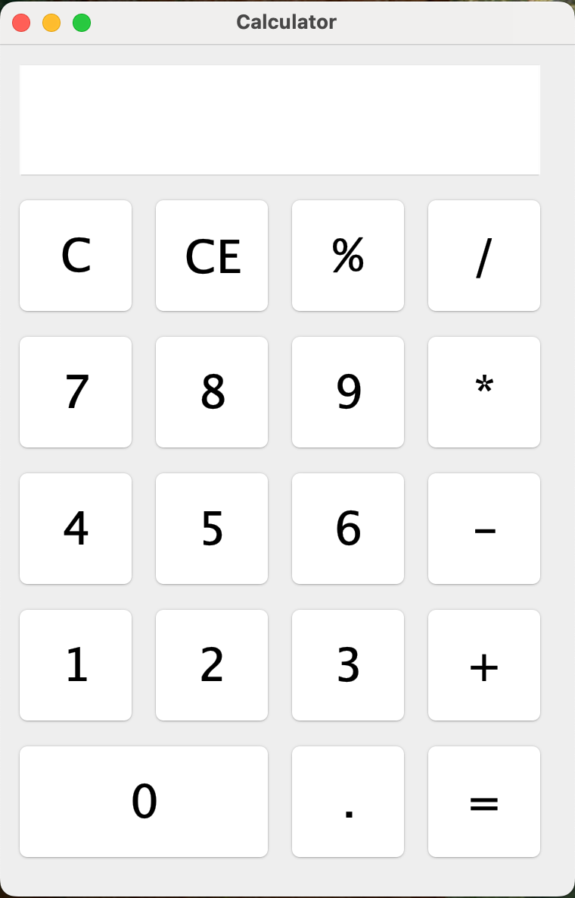
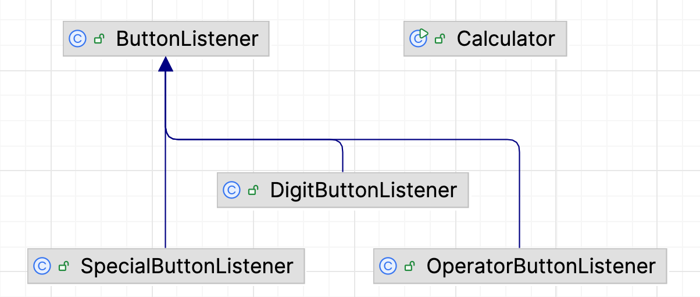

# Task2: Calculator

**Copilot has generated a solution yet it still has several bugs. Please read the "Background" below carefully and finish the task.**

## Background

This project is aimed at implementing a Calculator using Java GUI Programming APIs, which includes the front-end GUI and back-end logic. The figure below shows the example of the front-end GUI.

1. **Text Field:** display the current input number;
2. **19 Buttons:** include 11 digital buttons (0~9 and .), 5 operator buttons (+, -, \*, /, %) and two special buttons (C, CE) used as clearing and backspace functions specifically.

   

The unit length of the button is set as **80** and bound length is set as **10**. Calculator also has 3 special attributes: 1) **boolean** attribute ‘clear’ indicates if the text field has no text; 2) **double** attribute ‘number’ stores the first number; 3) **char** attribute ‘operator’ stores the current operator.

For example, when user tries to calculate "3 _ 4 =", we store the first number "3" into the ‘number’ attribute, and operator " _ " into ‘operator’ attribute. When user finishes input "4" and click "=", do calculation: ‘number’ (3) ‘operator’ (\*) ‘text field’ (4) and display the result 12 into the text field.

The following figure shows the structure of code files. These button listeners are used to implement the back-end logic of the calculator. `DigitalButtonListener`, `SpecialButtonListener` and `OperatorButtonLister` extend parent class `ButtonListener`.

   

## Your Task

1. Open **Calculator.java**, Github Copilot has written a solution for initialization of buttons. However, there are many bugs in it. Please find and fix those problems so that it can return the correct output with an example input.
   The problem is concerned with both **layout** and **functionality**. The desired calculator should be like the picture showed in **Background** section.

**When you finished fixing the bug in initializing buttons, please let the interviewer know.**
