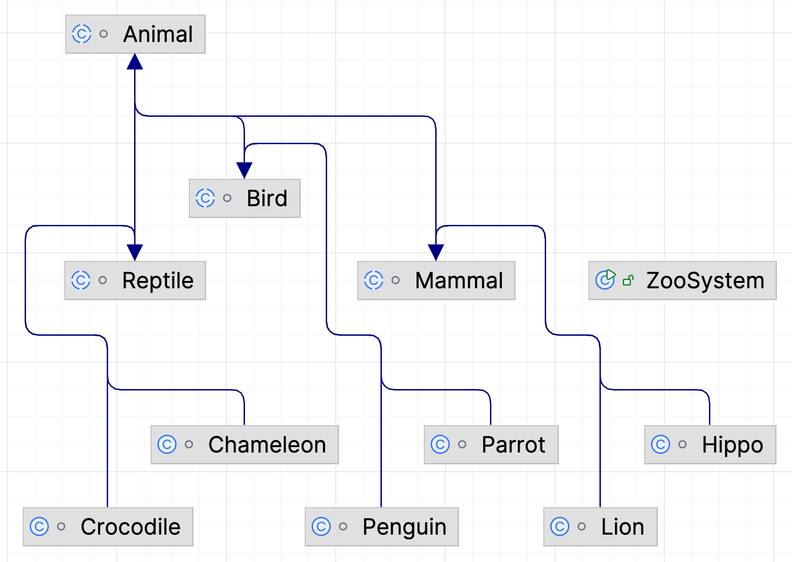

# Task3: Zoo System

**This is an Object-Oriented Programming task. Copilot has generated a solution yet it still has several bugs. Please read the "Background" below carefully and finish the task.**
(This task is inspired by Dr. Shreya Kumar’s Programming Paradigm Homework 4)

## Background

The Potawatomi Zoo needs to create an animal care/enclosure management system. The zoo may have hundreds of animals and needs to be able to scale with these quantities. The zoo keepers want to be able to access key information about different animals such as their conservation status and names. There should be functions that can display this information so the employees can access it faster.

### UML Tree

<p align="center">
   
</p>

_(You only need to briefly read this UML Tree to understand the structure of the project)_

### Classes that you need to know:

- **ZooSystem:** Handles and performs operations determined by the user
- **Animal:** Contains the top most properties and methods common to all the animals in the zoo. The children of this class will be broken into three taxonomic classes. The three will be Mammalia, Aves, and Reptilia.
  Its attributes include `name`, `species`, `conservationStatus`, `chambersInHeart`, `eatingHabits`, and `bloodType`.
- **Mammal:** Child of `Animal` that contains the overarching traits of mammals.
  Its attribute is `furColor`.
- **Reptile:** Child of `Animal` that contains the overarching traits of reptiles.
  Its attributes include `scaleColor` and `eggSize`.
- **Lion:** Child of `Mammal` that contains the traits of Lions.
  This includes `maneSize`, `colorOfMane`, and `lionType`
- **Chameleon:** Child of Reptile that contains the traits of Chameleon.
  Its attribute includes `chameleonType`.

## Your Task:

Open **ZooSystem_Raw** folder. Github Copilot wrote some methods in this problem. However, there are many bugs in it. Please find and fix those problems so that you can get the same output as expected output.

**When you finished each subtask `Chameleon.java`, `Lion.java` and `ZooSystem.java`, please let the interviewer know.**

1. Go to **Chameleon.java Line 26**
   **Task3.1:** Copilot created a method called `changeScaleColor()` to set `scaleColor` to a random color and print out the color. Please find the bug in the method and fix it.

2. Go to **Lion.java Line 7**
   **Task3.2:** Copilot created two constructors for the `Lion` class that takes in the following parameters:
   one only takes `name` as input;
   the other takes `name`, `maneSize`, `colorOfMane` and `lionType` as input.
   Please find the bug in the method and fix it. You can refer to the UML Tree.
   **Default value:**

- `species="Lion"`
- `sonservationStatus="Vulnerable"`
- `eatingHabits="Carnivore" `
- `furColor="Yellow-Gold"`
- `maneSize=1.5`
- `colorOfMane="Brown"`
- `lionType="Barbary"`

3.  Go to **ZooSystem.java Line 217 and Line 464**
    **Task 3.3:** Copilot wrote a function called `searchAnimal(String  attribute, String  value, Animal[] alist)` to search for all the animals that matches the given `value` of the `attribute` (e.g. `Name`, `Species`, `Conservation Status`, `Heart Chambers`, `Eating Habits`) and display all the animals with that attribute with `printVerboseList(Animal[] list)` function
    please find the bug in the method and fix it.

## Expected Output

```
Running instance of the ZooSystem system...


Set animals

Summary:
1 Lion(s)
1 Hippo(s)
1 Crocodile(s)
1 Chameleon(s)
1 Penguin(s)
1 Parrot(s)


   Name       Species    Conservation Status  Heart Chambers  Blood Type      Eating Habits
1  Daisy      Lion       Vulnerable           4               Warm Blooded    Carnivore
2  Marlee     Hippo      Vulnerable           4               Warm Blooded    Herbivore
3  Jawsy      Crocodile  Not Extinct          3               Cold Blooded    Carnivore
4  Fido       Chameleon  Not Extinct          3               Cold Blooded    Omnivore
5  Shamu      Penguin    Not Extinct          4               Warm Blooded    Carnivore
6  Bagheera   Parrot     Not Extinct          4               Warm Blooded    Omnivores

Type exit at any time to end the program.
Options:
Add animal (add)
Delete animal (delete)
Display animal (display)
Search for animal (search)
display
What animal would you like to display information aobut?
Please enter the name: Fido
Fido is a happy Jackson's Chameleon.
Make sound: siii huaoooo, siii huaooooo
Eat Fido is eating a poor grasshopper. Yummy!
Spawn: baby chalemeon comes from eggs.
Fido has just launged its tongue.
Fido has changed color to orange.
Fido is orange.
Fido is now shedding its scales.
Fido has just layed 31 eggs. Each is 1.0 unit big.

Summary:
1 Lion(s)
1 Hippo(s)
1 Crocodile(s)
1 Chameleon(s)
1 Penguin(s)
1 Parrot(s)


   Name       Species    Conservation Status  Heart Chambers  Blood Type      Eating Habits
1  Daisy      Lion       Vulnerable           4               Warm Blooded    Carnivore
2  Marlee     Hippo      Vulnerable           4               Warm Blooded    Herbivore
3  Jawsy      Crocodile  Not Extinct          3               Cold Blooded    Carnivore
4  Fido       Chameleon  Not Extinct          3               Cold Blooded    Omnivore
5  Shamu      Penguin    Not Extinct          4               Warm Blooded    Carnivore
6  Bagheera   Parrot     Not Extinct          4               Warm Blooded    Omnivores

Type exit at any time to end the program.
Options:
Add animal (add)
Delete animal (delete)
Display animal (display)
Search for animal (search)
add
What animal would you like to add to the zoo?
Please enter the species (Ex: Lion, Hippo, Crocodile, Chameleon, Penguin, Parrot): Lion
Please enter the name (Ex: Bob, Alex, Spot): Bob
Do you want to add more detail? (y/n): y
Mane size (feet): 2
Color of mane: Brown
Lion type: African

Summary:
2 Lion(s)
1 Hippo(s)
1 Crocodile(s)
1 Chameleon(s)
1 Penguin(s)
1 Parrot(s)


   Name       Species    Conservation Status  Heart Chambers  Blood Type      Eating Habits
1  Daisy      Lion       Vulnerable           4               Warm Blooded    Carnivore
2  Marlee     Hippo      Vulnerable           4               Warm B

looded    Herbivore
   3  Jawsy      Crocodile  Not Extinct          3               Cold Blooded    Carnivore
   4  Fido       Chameleon  Not Extinct          3               Cold Blooded    Omnivore
   5  Shamu      Penguin    Not Extinct          4               Warm Blooded    Carnivore
   6  Bagheera   Parrot     Not Extinct          4               Warm Blooded    Omnivores
   7  Bob        Lion       Vulnerable           4               Warm Blooded    Carnivore

   Type exit at any time to end the program.
   Options:
   Add animal (add)
   Delete animal (delete)
   Display animal (display)
   Search for animal (search)
   display
What animal would you like to display information aobut?
Please enter the name: Bob

Bob is a happy African lion. Bob has a 2.0-feet long Brown mane.
Here are its behaviors:
Make sound: roar, growl, snarl
Eat: Bob eats medium-sized to large hoofed animals like wildebeests, zebras, and antelopes.
Spawn: baby lions are cubs. They come to the world from their mom's body.
Male lions tend to shed their manes after a loss in combat.
Bob and its partner have just got 1 new baby.
What a hot day! Bob is sweating. It's looking for a cool place.
Bob is chasing a poor zebra. Let's see who will win/survive.

Summary:
2 Lion(s)
1 Hippo(s)
1 Crocodile(s)
1 Chameleon(s)
1 Penguin(s)
1 Parrot(s)


   Name       Species    Conservation Status  Heart Chambers  Blood Type      Eating Habits
1  Daisy      Lion       Vulnerable           4               Warm Blooded    Carnivore
2  Marlee     Hippo      Vulnerable           4               Warm Blooded    Herbivore
3  Jawsy      Crocodile  Not Extinct          3               Cold Blooded    Carnivore
4  Fido       Chameleon  Not Extinct          3               Cold Blooded    Omnivore
5  Shamu      Penguin    Not Extinct          4               Warm Blooded    Carnivore
6  Bagheera   Parrot     Not Extinct          4               Warm Blooded    Omnivores
7  Bob        Lion       Vulnerable           4               Warm Blooded    Carnivore

Type exit at any time to end the program.
Options:
Add animal (add)
Delete animal (delete)
Display animal (display)
Search for animal (search)
search
What attribute would you like to search by?
Please enter the attribute (Ex: Name, Species, Conservation Status, Heart Chambers, Blood Type, Eating Habits): Heart Chambers
What value would you like to search for?
Please enter the value: 4
   Name       Species    Conservation Status  Heart Chambers  Blood Type      Eating Habits
1  Daisy      Lion       Vulnerable           4               Warm Blooded    Carnivore
2  Marlee     Hippo      Vulnerable           4               Warm Blooded    Herbivore
3  Shamu      Penguin    Not Extinct          4               Warm Blooded    Carnivore
4  Bagheera   Parrot     Not Extinct          4               Warm Blooded    Omnivores
5  Bob        Lion       Vulnerable           4               Warm Blooded    Carnivore

Summary:
2 Lion(s)
1 Hippo(s)
1 Crocodile(s)
1 Chameleon(s)
1 Penguin(s)
1 Parrot(s)


   Name       Species    Conservation Status  Heart Chambers  Blood Type      Eating Habits
1  Daisy      Lion       Vulnerable           4               Warm Blooded    Carnivore
2  Marlee     Hippo      Vulnerable           4               Warm Blooded    Herbivore
3  Jawsy      Crocodile  Not Extinct          3               Cold Blooded    Carnivore
4  Fido       Chameleon  Not Extinct          3               Cold Blooded    Omnivore
5  Shamu      Penguin    Not Extinct          4               Warm Blooded    Carnivore
6  Bagheera   Parrot     Not Extinct          4               Warm Blooded    Omnivores
7  Bob        Lion       Vulnerable           4               Warm Blooded    Carnivore

Type exit at any time to end the program.
Options:
Add animal (add)
Delete animal (delete)
Display animal (display)
Search for animal (search)
exit
```
